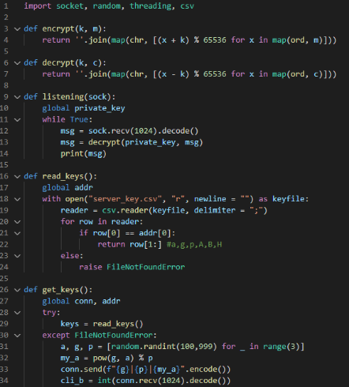

При запуске клиент и сервер генерируют каждый свою пару ключей. При подключении клиент посылает серверу свой открытый ключ. В ответ, сервер посылает клиенту открытый ключ сервера. Клиент посылает сообщение серверу, шифруя его своим закрытым ключом и открытым ключом сервера. Сервер принимает сообщение, расшифровывает его сначала своим закрытым ключом, а потом - открытым ключом клиента. Обратное сообщение посылается аналогично. Для Шифровки - расшифровки используем фукнции симметричного шифрования из предыдущей работы по симметричному шифрованию по Unix

Далее в фукнции get\_keys() читаем уже существующие ключи, если их нет создаются новые.

Модифицируйте код клиента и сервера так, чтобы приватный и публичный ключ хранились в текстовых файлах на диске и, таким образом, переиспользовались между запусками. Реализовано в коде, можно убедиться что между запусками ключи в файлах не меняются. csv файл с ключами клиента

csv файл с ключами сервера

Сервер хранит ключи для каждого из клиентов (по IP) Проведите рефакторинг кода клиента и сервера так, чтобы все, относящееся к генерации ключей, установлению режима шифрования, шифрованию исходящих и дешифрованию входящих сообщений было отделено от основного алгоритма обмена сообщениями.

Можно увидеть в коде

Реализуйте на сервере проверку входящих сертификатов. На сервере должен храниться список разрешенных ключей. Когда клиент посылает на сервер свой публичный ключ, сервер ищет его среди разрешенных и, если такого не находит, разрывает соединение. Проверьте правильность работы не нескольких разных клиентах. Важно! данный пункт предполагает, что ключи уже существуют, поэтому в репозитории приложены файлы с уже созданными ключами. Разрешенные открытые ключи клиентов хранятся в файле allowed.csv

Модифицируйте код клиента и сервера таким образом, чтобы установление режима шифрования происходило при подключении на один порт, а основное общение - на другом порту. Номер порта можно передавать как первое зашифрованное сообщение. Также можно увидеть в коде, и сервер и клиент выводят сообщени о подключении к конкретному порту. Изначально сервер подключился на порте 10101

После подключения клиента они переключились на новый (рандомный) порт и продолжают общение на нем

Модифицируйте код FTP-сервера таким образом, чтобы он поддерживал шифрование.

методы send/recv заменены на собственно написанные s\_send/s\_recv которые поддерживают шифрование. Обмен ключами и генерация происходят при каждом запросе и каждый раз разные соответственно.

